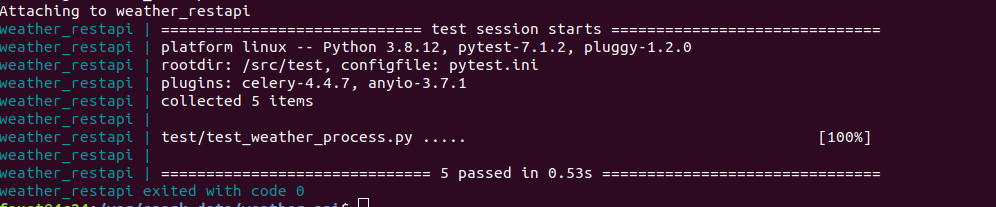
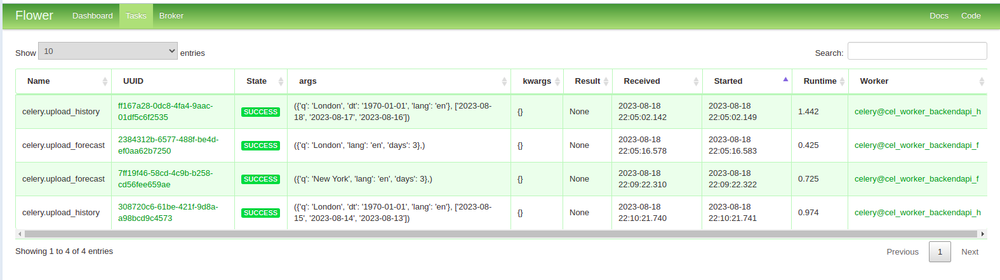
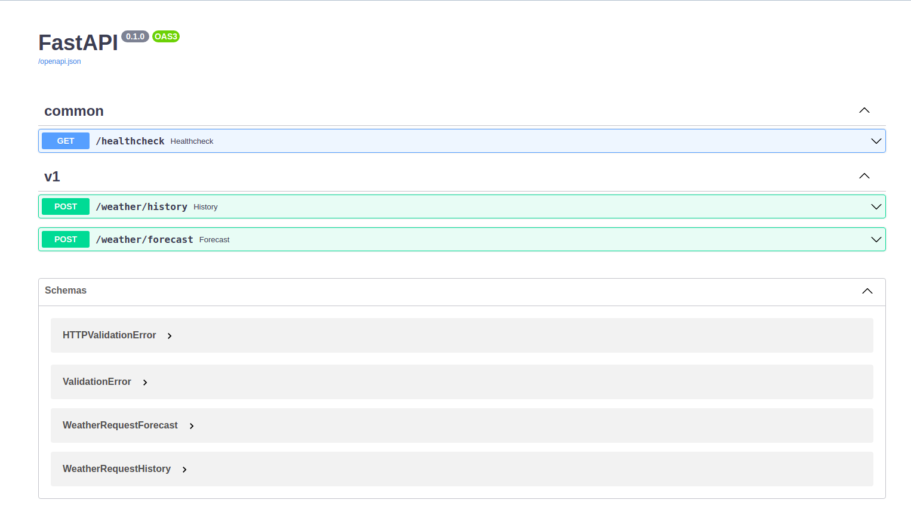

# weather_api
Architecture of a micro-service that exposes a REST API and delivers the functionality of caching data in local storage

<h3>As the source of data I will get the data from https://weatherapi-com.p.rapidapi.com</h3>

--------------------------------------------------------------------

### Task realization:

#### 1. Structure of data transformation

- We have next attributes within raw data : 'time_epoch', 'time', 'temp_c', 'temp_f', 'is_day', 'wind_mph', 'wind_kph', 'wind_degree','wind_dir', 'pressure_mb', 'pressure_in', 'precip_mm', 'precip_in', 'humidity', 'cloud', 'feelslike_c', 'feelslike_f', 'windchill_c', 'windchill_f', 'heatindex_c','heatindex_f', 'dewpoint_c', 'dewpoint_f', 'will_it_rain','chance_of_rain', 'will_it_snow', 'chance_of_snow', 'vis_km','vis_miles', 'gust_mph', 'gust_kph', 'uv', 'condition.text',       'condition.icon', 'condition.code', 'location.name', 'location.region','location.country', 'location.lat', 'location.lon', 'location.tz_id',       'location.localtime_epoch', 'location.localtime', 'forecast.forecastday'<br>
- For simplifying I will use next fields: 'geo_id', 'latitude', 'longitude', 'pressure_mb', 'datetime_update', 'datetime', 'temp_c', 'is_day', 'cloud', 'temp_c_feelslike','condition_id', 'humidity', 'wind_speed_kph', 'wind_gust_kph','uv_index', 'wind_direction'. 

<h2 align="center"> ERD<br>

  
</h2>

---------------------------------------------------------------------------------------------
#### 2. Prerequisites

-  Docker install (https://www.docker.com)
-  Preferable OS is Linux
-  Python install (https://www.python.org), ver 3.8
-  Provisioning : RAM from 8 Gb, CPU from 2, HDD from 20 Gb

### Deploying

For deploying I'll use docker-compose.yml, which provides 4 services:

1. Database (PostgreSQL)
2. pgAdmin (for viewing and administration DB)
3. weather_backend - instance of service which responsible for parsing data from Weather API and storing them to DB 
4. weather_restapi - main instance of REST API which provides necessary methods.

### Testing
The existing tests cover the processing data from Weather API in the directory test
For ensuring that all provided tests are passed - I'll use test_docker-compose.yml By running next commans in terminal

Before runing, please, specify .env file with all necessary configs and credentials. Especially, ensure the correct requisites like host address, ports.

```bash
_node: ~/work/weather_api$ docker-compose -f test_docker-compose.yml up --build
```



========================================================================================================================

### Running all instances
if all tests are passed - I'll deploy the main docker-compose file

```bash
_node: ~/work/weather_api$ docker-compose up --build -d
```

### Sampling data to DB and checking backend service

<b>weather_backend</b> - worker which consist from combination Flask-Redis-Celery and can execute delayed tasks by requesting API call

url_post = 'http://<url_of_my_host>:<port>/tasks'

payload = { 
    'querystring':{
        "q":"London",
        "lang":"en",
    }, 
    'days':3, 
    'token': '<my access token>',
    'task_type':'upload_forecast'
}

```bash
response = requests.post(url_post, json = payload) 
response.text
```
{"task_id":"5efac0a4-be3d-42ba-94d4-b946adcdc5bd"}

Please, visit Flower - service of monitoring our tasks

'http://<url_of_my_host>:<port_of_flower>'



### API methods

Please, visit Swagger page for discovering two main endpoints:

'http://<url_of_my_host>:<port_of_api>/docs'

- historical data : /weather/history
- forecast data : /weather/forecast



----------------------------------------------------------------------------------------